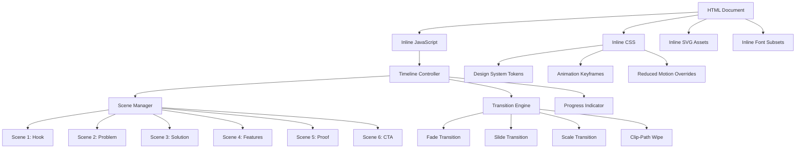

# Design Document: PACTA Demo Ad

## Overview

The PACTA Demo Ad is a standalone, self-contained HTML page that auto-plays a 1-minute cinematic advertisement for PACTA. It tells the PACTA story through 6 sequenced scenes (Hook → Problem → Solution → Features → On-Chain Proof → CTA) with smooth CSS transitions, optimized for 1920×1080 screen recording.

The page is delivered as a single HTML file with all CSS, JavaScript, SVG assets, and font subsets inlined. It requires no build step, no network, and no user interaction to play. The architecture separates concerns into three layers: a declarative scene/timeline data model, a transition engine, and a rendering layer.

**Key design decisions:**
- Single-file delivery over multi-file: simpler for hackathon submission, ensures zero dependencies
- CSS animations over JS-driven frames: leverages GPU compositing for 60fps, simpler to implement, better `will-change` support
- Declarative timeline model: scenes and transitions defined as data, making timing adjustable without touching animation code
- `prefers-reduced-motion` as a first-class mode: static scene navigation via keyboard when motion is disabled

## Architecture



**Execution flow:**

1. On `window.load`, the Timeline Controller initializes and begins playback within 500ms
2. The Scene Manager activates scenes sequentially based on the timeline schedule
3. The Transition Engine applies the configured CSS transition between outgoing and incoming scenes
4. The Progress Indicator updates continuously via `requestAnimationFrame`
5. On the final scene, the Timeline Controller halts and holds the frame indefinitely

**Reduced motion path:**

When `prefers-reduced-motion: reduce` is detected, the Timeline Controller disables auto-play and switches to keyboard navigation mode. Scenes render statically, and arrow keys / spacebar advance between them.

## Components and Interfaces

### Timeline Controller

The central orchestrator. Manages playback state, schedules scene transitions, and coordinates the progress indicator.

```typescript
interface TimelineConfig {
  scenes: SceneDefinition[];
  totalDuration: number; // 55–65 seconds
  autoPlay: boolean;
}

interface SceneDefinition {
  id: string;
  title: string;            // for aria-live announcements
  summary: string;          // narrative summary for accessibility
  duration: number;         // hold time in ms (5000–15000)
  transition: TransitionConfig;
  elements: SceneElement[];
}

interface TransitionConfig {
  type: 'fade' | 'slide-left' | 'slide-up' | 'scale' | 'clip-wipe';
  duration: number;         // 600–1200ms
  easing: string;           // CSS easing function
}
```

**API:**
- `start()` — begins auto-play from scene 0
- `pause()` / `resume()` — for potential dev controls
- `goToScene(index)` — used in reduced-motion keyboard nav
- `getProgress()` — returns 0–1 for the progress bar

### Scene Manager

Handles DOM visibility of scenes. Each scene is a full-viewport `<section>` positioned absolutely. Only the active scene (and transitioning scenes) are visible.

```typescript
interface SceneElement {
  type: 'headline' | 'body' | 'icon' | 'proof-panel' | 'flow-diagram' | 'badge' | 'wordmark' | 'url';
  content: string;
  entryAnimation: EntryAnimation;
  delay: number;           // stagger delay from scene start
}

interface EntryAnimation {
  type: 'fade-in' | 'slide-up' | 'type-on' | 'scale-up' | 'count-up';
  duration: number;        // 200–600ms
}
```

### Transition Engine

Applies CSS class-based transitions between scenes. Uses `will-change: transform, opacity` on scene containers for GPU layer promotion.

```typescript
interface TransitionEngine {
  execute(outgoing: HTMLElement, incoming: HTMLElement, config: TransitionConfig): Promise<void>;
}
```

Implementation uses CSS classes toggled via JS:
- `.scene-enter-fade` — opacity 0 → 1
- `.scene-enter-slide-left` — translateX(100%) → translateX(0)
- `.scene-enter-slide-up` — translateY(50px) → translateY(0)
- `.scene-enter-scale` — scale(0.9), opacity 0 → scale(1), opacity 1
- `.scene-enter-clip-wipe` — clip-path: inset(0 100% 0 0) → inset(0 0 0 0)
- Corresponding `.scene-exit-*` classes for outgoing scenes

### Progress Indicator

A 4px bar at the top of the viewport, accent color at 80% opacity. Updates via `requestAnimationFrame` during playback.

### Accessibility Layer

- `aria-live="polite"` region announces scene title + summary on change
- In reduced-motion mode: `tabindex="0"` on scene container, visible focus ring, keyboard event listeners
- All text meets WCAG contrast ratios against their backgrounds

## Data Models

### Timeline Schedule

The concrete timeline for the 6-scene narrative arc:

| # | Scene | Duration | Transition In | Transition Duration |
|---|-------|----------|---------------|---------------------|
| 1 | Hook (Logo + Tagline) | 7s | fade | 800ms |
| 2 | Problem Statement | 9s | slide-left | 900ms |
| 3 | Solution Introduction | 9s | clip-wipe | 1000ms |
| 4 | Key Features (Send Protected Flow) | 12s | slide-up | 800ms |
| 5 | On-Chain Proof | 10s | scale | 900ms |
| 6 | CTA | 8s | fade | 800ms |

**Total:** 7 + 9 + 9 + 12 + 10 + 8 = 55s scene hold + ~5.2s transitions = ~60s

### Design System Token Map (Inlined CSS Custom Properties)

```css
:root {
  --canvas: #F4F2EC;
  --ink: #1A201D;
  --slate: #586059;
  --fog: #8C918A;
  --accent: #0B7A63;
  --signal: #34E3B0;
  --carbon: #0B0F0E;
  --grid: #233029;
  --deadline-amber: #C77D11;
  --refund-clay: #B43A2C;
  --font-sans: 'Plus Jakarta Sans', system-ui, -apple-system, sans-serif;
  --font-mono: 'JetBrains Mono', ui-monospace, SFMono-Regular, Menlo, monospace;
}
```

### Scene Content Model

Each scene's content is defined declaratively:

**Scene 1 (Hook):** PACTA wordmark (SVG), tagline "Trust, written in code.", subtle emerald glow animation on wordmark.

**Scene 2 (Problem):** Headline "Your payment disappeared.", supporting stat "63% of Filipino freelancers have lost money to unpaid invoices", warning icon, scattered peso symbols fading out.

**Scene 3 (Solution):** PACTA name, description "A wallet-native money app on Stellar. Non-custodial protection for every payment.", shield/lock icon with emerald accent.

**Scene 4 (Features):** Animated flow diagram (Sender → Contract → Milestone Release → Recipient) with labeled nodes and animated tokens. Badges: milestone bar, security bond, AI Risk Lens, non-custodial.

**Scene 5 (Proof):** Proof Panel (carbon bg, signal-mint text) with animated count-up from 0 to 100 XLM, mock contract address, mock tx hash appearing character by character.

**Scene 6 (CTA):** PACTA wordmark, live URL text, hackathon track name, action prompt "Try PACTA — protect your next payment."

## Correctness Properties

*A property is a characteristic or behavior that should hold true across all valid executions of a system — essentially, a formal statement about what the system should do. Properties serve as the bridge between human-readable specifications and machine-verifiable correctness guarantees.*

### Property 1: Timeline total duration is within bounds

*For any* valid timeline configuration (a set of scenes with hold durations and transitions with durations), the sum of all scene hold durations plus all transition durations SHALL be between 55,000 and 65,000 milliseconds.

**Validates: Requirements 2.2, 4.6**

### Property 2: Scene configuration bounds

*For any* valid timeline configuration, the number of scenes SHALL be between 5 and 8 (inclusive), and each individual scene's hold duration (excluding its entry transition) SHALL be between 5,000 and 15,000 milliseconds.

**Validates: Requirements 3.1**

### Property 3: Transition duration bounds

*For any* transition between adjacent scenes in a timeline, its duration SHALL be between 600 and 1,200 milliseconds.

**Validates: Requirements 4.2**

### Property 4: Transition type diversity

*For any* valid complete timeline configuration, the set of distinct transition types used across all scene transitions SHALL contain at least 3 different types (where types are distinguished by their primary CSS animation property: opacity, translateX/Y, scale, or clip-path).

**Validates: Requirements 4.3**

### Property 5: Progress indicator monotonicity

*For any* two elapsed-time values t1 and t2 where 0 ≤ t1 < t2 ≤ totalDuration, the progress value computed at t2 SHALL be strictly greater than or equal to the progress value computed at t1, and the progress at t=0 SHALL be 0 and at t=totalDuration SHALL be 1.

**Validates: Requirements 2.3**

### Property 6: Text visibility minimum hold time

*For any* text element (headline or body) in any scene, the difference between the scene's hold duration and the element's entry animation delay plus entry animation duration SHALL be at least 3,000 milliseconds — ensuring the text remains fully visible for a minimum of 3 seconds before the scene transitions out.

**Validates: Requirements 6.6**

### Property 7: Body text word count per scene

*For any* scene's body text content (human-readable descriptive text, excluding headlines, labels, and monospace on-chain data), the word count SHALL not exceed 20 words.

**Validates: Requirements 6.1**

### Property 8: Viewport scaling calculation

*For any* viewport dimensions (width, height) where width < 1920 or height < 1080, the computed scale factor SHALL equal min(width / 1920, height / 1080), and the result SHALL always be ≤ 1.0, preserving the 16:9 aspect ratio without cropping.

**Validates: Requirements 7.6**

### Property 9: Reduced motion navigation round-trip

*For any* sequence of N forward-navigation actions followed by N backward-navigation actions (where N ≤ total scene count - 1), the current scene index SHALL return to the starting scene index, and the scene content displayed SHALL be identical to its initial render.

**Validates: Requirements 10.2**

## Error Handling

Since this is a self-contained page with no network or user input during playback, error conditions are limited:

| Scenario | Handling |
|----------|----------|
| CSS animations not supported | JavaScript `setTimeout` fallback displays scenes as static frames for their designated durations (Req 8.6) |
| Font subset fails to render | CSS font stack falls through to system-ui (humanist sans) and ui-monospace (monospace) |
| Browser viewport < 1920×1080 | CSS `transform: scale()` shrinks the fixed container proportionally (Req 7.6) |
| `requestAnimationFrame` unavailable | Fall back to `setTimeout(fn, 16)` for progress bar updates |
| Scene DOM fails to load | Timeline skips the scene and moves to next, logging to console (non-blocking) |
| JavaScript disabled | CSS-only animation fallback: scenes use `@keyframes` with delays calculated to auto-advance (graceful degradation) |

**Reduced motion detection:**
- Check `window.matchMedia('(prefers-reduced-motion: reduce)')` on load
- Listen for changes via `matchMedia.addEventListener('change', ...)` to switch modes dynamically

## Testing Strategy

### Unit Tests (Vitest)

Example-based tests for specific behaviors and content verification:
- Scene content verification: each scene contains required elements per its narrative arc role (Req 3.3–3.8)
- Design system compliance: all colors match the palette, font sizes meet minimums (Req 5.1–5.8)
- Auto-play initiates within 500ms of load event (Req 2.1)
- Final scene holds indefinitely with no further transitions (Req 2.5)
- At least one directional wipe/reveal transition exists (Req 4.5)
- CSS animations use only transform/opacity (no layout-triggering properties) (Req 8.1)
- `will-change` hints present on animated elements (Req 8.2)
- No `setInterval` used for animation (Req 8.3)
- Proof panel styling matches spec (carbon bg, grid border, signal text, no shadow) (Req 5.5)
- PACTA logo present in first and last scenes (Req 9.4)
- Reduced motion CSS rule sets durations to 0ms (Req 10.1)
- `aria-live` region exists and updates with scene title/summary (Req 10.4)

### Property-Based Tests (fast-check via Vitest)

Each property test implements one correctness property from the design, running a minimum of 100 iterations:

| Property | Test Description | Tag |
|----------|-----------------|-----|
| 1 | Generate random scene/transition duration arrays, verify total in [55000, 65000]ms | `Feature: pacta-demo-ad, Property 1: Timeline total duration is within bounds` |
| 2 | Generate random scene counts [5–8] and durations, verify each in [5000, 15000]ms | `Feature: pacta-demo-ad, Property 2: Scene configuration bounds` |
| 3 | Generate random transition durations, verify all in [600, 1200]ms | `Feature: pacta-demo-ad, Property 3: Transition duration bounds` |
| 4 | Generate random transition type assignments across scenes, verify ≥ 3 distinct types | `Feature: pacta-demo-ad, Property 4: Transition type diversity` |
| 5 | Generate random elapsed time pairs (t1 < t2), verify progress(t1) ≤ progress(t2) | `Feature: pacta-demo-ad, Property 5: Progress indicator monotonicity` |
| 6 | Generate random text elements with entry delays/durations within scenes, verify ≥ 3000ms visible | `Feature: pacta-demo-ad, Property 6: Text visibility minimum hold time` |
| 7 | Generate random body text strings, verify word count ≤ 20 per scene | `Feature: pacta-demo-ad, Property 7: Body text word count per scene` |
| 8 | Generate random viewport sizes (< 1920×1080), verify scale = min(w/1920, h/1080) ≤ 1.0 | `Feature: pacta-demo-ad, Property 8: Viewport scaling calculation` |
| 9 | Generate random navigation sequences (N forward + N back), verify return to start | `Feature: pacta-demo-ad, Property 9: Reduced motion navigation round-trip` |

**Library:** fast-check (already compatible with Vitest)
**Iterations:** Minimum 100 per property (default: 100, can increase for critical properties)

### Visual / Manual Tests

- Open in Chrome at 1920×1080, verify full-viewport rendering with no scrollbars
- Screen-record with OBS and verify 60fps in playback
- Enable `prefers-reduced-motion` in DevTools, verify keyboard navigation works
- Check Network tab is empty after load (no external resources)
- Verify in Chrome DevTools Performance panel: no layout thrashing, all animations on compositor thread
- Cross-browser check: Chrome, Firefox, Safari (latest 2 major versions)
- Verify no more than 15 elements animating simultaneously (Req 8.4)

### Accessibility Tests

- Run axe-core or Lighthouse accessibility audit on the static page
- Verify all text contrast ratios meet WCAG AA (4.5:1 body, 3:1 large)
- Verify `aria-live` announcements fire on scene change
- Verify visible focus indicator in reduced-motion keyboard mode
- Verify keyboard focus moves to scene container on navigation
