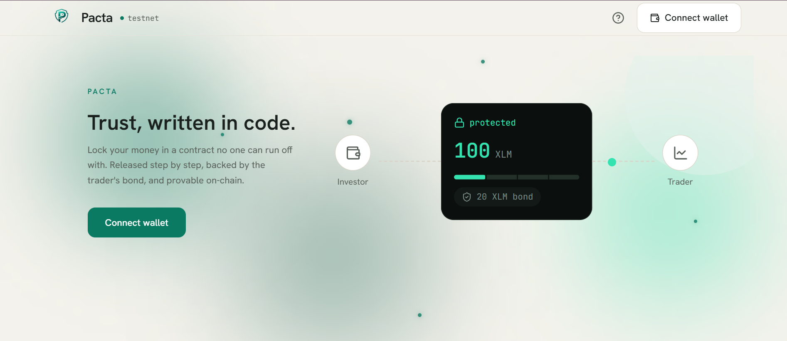

# Pacta

> **Trust, written in code.**

Pacta is a non-custodial escrow protocol on **Stellar**, powered by **Soroban** smart contracts. It turns the informal, trust-based money agreements that people make with independent online traders into secure, programmable contracts: capital is released in milestone tranches, protected by a trader-posted security bond, refundable if the trader fails to deliver, and provable on-chain. An AI Risk Lens reads a trader's on-chain history and tells a first-time user, in plain language, how trustworthy they look.

<p>
  
  
  
</p>

<p align="center">
  
</p>

---

## 🔗 Links

| | |
|---|---|
| **Live app** | [https://pacta-zarrah.vercel.app](https://pacta-zarrah.vercel.app) |
| **Demo video** | [TODO: add demo video link] |
| **Smart contract (testnet)** | [View on Stellar Expert](https://stellar.expert/explorer/testnet/contract/CBLSIW2L5BV2KOM73EGXPZBO7DCVVW5TF2ROMYJZSZUTMSMGIFFEL3HL) |
| **GitHub** | https://github.com/zazazzz-exe/PACTA.git |

---

## Table of contents

- [The problem](#the-problem)
- [The solution](#the-solution)
- [How Pacta works](#how-pacta-works)
- [Features](#features)
- [The AI Risk Lens](#the-ai-risk-lens)
- [Screenshots](#screenshots)
- [Architecture](#architecture)
- [Tech stack](#tech-stack)
- [Smart contract reference](#smart-contract-reference)
- [Getting started](#getting-started)
- [Project structure](#project-structure)
- [Testing](#testing)
- [Monitoring and analytics](#monitoring-and-analytics)
- [Production deployment](#production-deployment)
- [User onboarding and feedback](#user-onboarding-and-feedback)
- [Roadmap](#roadmap)
- [Team](#team)
- [License](#license)
- [Submission checklist](#submission-checklist)

---

## The problem

Every day, thousands of people, especially Overseas Filipino Workers (OFWs), seafarers, and first-time investors, hand their savings to independent traders they meet in Facebook groups, Telegram channels, and Discord servers. These arrangements run entirely on trust: money sent over GCash, bank transfer, or crypto with no contract, no transparency, and no protection. When a trader disappears or misuses the funds, the investor usually loses everything and has no recourse. There is no accessible, low-cost tool that lets ordinary people safely entrust money to someone else online.

## The solution

Pacta fixes this not by asking people to trust harder, but by making trust enforceable. Instead of sending money directly to a trader, the investor locks it in a Soroban escrow contract that:

- **Releases capital in milestone tranches** so only a portion is ever exposed at a time.
- **Requires a security bond** the trader posts as skin in the game.
- **Refunds automatically** if the trader fails to deliver by the deadline: the investor reclaims the unreleased capital plus the trader's bond.
- **Records every agreement on-chain**, building a portable reputation that turns anonymous traders into accountable ones.

Pacta does not give investment advice, take custody of trading profits, or guarantee returns. It is **trust infrastructure**.

## How Pacta works

```
            create agreement
                  │
                  ▼
            ┌───────────┐   cancel
            │  Pending  │────────────▶ Cancelled   (deposits returned)
            └───────────┘
        post bond  +  deposit capital   (both required)
                  │
                  ▼
            ┌───────────┐
            │  Active   │
            └───────────┘
        release milestone × N           deadline passes, trader fails
                  │                                │
                  ▼                                ▼
            ┌───────────┐                    ┌───────────┐
            │ Completed │  bond → trader     │ Refunded  │  unreleased + bond → investor
            └───────────┘  reputation ✓      └───────────┘  reputation ⚠
```

**The protection model, honestly stated:** a naive "lock all the money and trust the trader" escrow is not actually safer, because once capital reaches the trader, code cannot claw it back. Pacta's protection comes from two mechanics that *are* enforceable on-chain: **staged release** (limiting exposure over time) and the **security bond** (collateralizing the released portion). The emergency refund returns the unreleased capital and seizes the bond, the concrete on-chain penalty for a trader who walks away.

## Features

- **Non-custodial escrow** on Stellar/Soroban, with milestone-based capital release.
- **Security bonds** and **deadline-gated emergency refunds**.
- **On-chain reputation** per trader (completed, refunded, total volume).
- **AI Risk Lens** that interprets a trader's on-chain history in plain language and suggests safer agreement terms.
- **Wallet-native auth** (Freighter and others via Stellar Wallets Kit) — no signup, no passwords.
- **Mobile-responsive UI** built mobile-first for the real user base.
- **Proper loading and error handling**: skeleton loaders, transaction-pending states, friendly contract-error messages, and graceful degradation when the AI endpoint is unavailable.

## The AI Risk Lens

When an investor is about to work with a trader, Pacta reads that trader's on-chain track record and shows a short, plain-language risk read plus a defensive milestone suggestion they can apply with one tap.

- All statistics (completed/refunded counts, volume, recency, deal-vs-history ratio) are computed deterministically in code, so the numbers are always correct.
- An LLM (**Claude**, via a serverless function that keeps the API key server-side) only *interprets* those correct numbers into language a first-time user can act on.
- It assesses **counterparty trustworthiness from on-chain history only** — never investment advice, never return predictions.

A brand-new address with no history is flagged as unproven rather than green-lit, which doubles as a lightweight anti-Sybil signal.

## Screenshots

> <!-- TODO: add real screenshots to docs/screenshots/ and update these -->

| Product UI | Mobile responsive | Analytics / monitoring |
|---|---|---|
|  |  |  |

## Architecture

```
┌───────────────────────────── Browser (SPA) ─────────────────────────────┐
│  React + Vite + TypeScript + Tailwind                                    │
│                                                                          │
│   UI screens ──▶ generated TS contract bindings ──▶ Stellar Wallets Kit  │
│        │                     │                              │ sign        │
│        │ risk read           │ read / write                ▼             │
│        ▼                     ▼                       Freighter / xBull    │
│  /api/risk-lens        Soroban RPC (testnet) ──▶ PactaEscrow contract     │
│  (serverless, Claude)                            + SAC token (XLM/USDC)   │
└──────────────────────────────────────────────────────────────────────────┘
```

**There is no traditional backend.** The Soroban contract is the source of truth and holds all state and funds. The only server-side code is one small serverless function (`/api/risk-lens`) that exists solely to keep the AI provider key off the client. Reads are free RPC simulations; writes are wallet-signed transactions.

- **Smart contract** (`contracts/pacta-escrow`): the escrow logic, bonds, staged release, refunds, and reputation. See the [reference](#smart-contract-reference) below.
- **Frontend** (`frontend/`): a Vite SPA. Wallet connection via Stellar Wallets Kit; contract calls via type-safe bindings generated by the Stellar CLI.
- **Design system** (`DESIGN.md`): a "Calm Trust" core (warm neutrals, a single emerald accent, monospace for all on-chain data) with one dark "proof panel" as the signature element.

## Tech stack

| Layer | Tech |
|---|---|
| Smart contract | Rust, `soroban-sdk`, Stellar CLI, deployed to Stellar **testnet** |
| Settlement asset | Stellar Asset Contract (native XLM SAC in demo; USDC SAC in production) |
| Frontend | Vite, React, TypeScript, Tailwind CSS |
| Wallet | `@creit.tech/stellar-wallets-kit` (Freighter, xBull, Albedo, WalletConnect) |
| Contract client | Generated TypeScript bindings (`stellar contract bindings typescript`) |
| AI Risk Lens | Claude (Anthropic) via a serverless function |
| Hosting | Vercel |
| Monitoring | Vercel Analytics + Speed Insights, Sentry (error tracking) |

## Smart contract reference

- **Network:** Stellar testnet · RPC `https://soroban-testnet.stellar.org` · passphrase `Test SDF Network ; September 2015`
- **Contract ID:** `[TODO: CONTRACT_ID]`
- **Explorer:** [Stellar Expert (testnet)](https://stellar.expert/explorer/testnet/contract/[TODO_CONTRACT_ID])

**Public interface:**

```
create_agreement(investor, trader, token, capital, bond, milestones, profit_share_bps, duration) -> u64
post_bond(agreement_id)
deposit_capital(agreement_id)
release_milestone(agreement_id) -> i128
complete(agreement_id)
emergency_refund(agreement_id)
cancel(agreement_id)
get_agreement(agreement_id) -> Agreement
get_reputation(trader) -> Reputation
get_count() -> u64
```

Authorization is enforced on-chain with `require_auth` (investor for create/deposit/release/complete/refund/cancel; trader for `post_bond`). Amounts are in the token's base units (7 decimals).

## Getting started

### Prerequisites

- [Rust](https://rustup.rs/) ≥ 1.91 (`rustup update`) and the `wasm32v1-none` target
- [Stellar CLI](https://developers.stellar.org/docs/tools/cli) v26+
- Node.js ≥ 18 and npm
- A wallet extension such as [Freighter](https://www.freighter.app/)

### 1. Clone and install

```bash
git clone [TODO: repo URL]
cd pacta
```

### 2. Deploy the contract and generate bindings

A one-command script builds, tests, deploys to testnet, resolves the token, and generates the TypeScript bindings:

```bash
bash scripts/deploy.sh
```

It prints the `CONTRACT_ID` and `TOKEN_ADDRESS`. Put them in the frontend config (below).

### 3. Run the frontend

```bash
cd frontend
npm install
npm install @fontsource/plus-jakarta-sans @fontsource/jetbrains-mono
npm run dev
```

### Environment variables

Create `frontend/.env` (and set the same in your hosting provider):

```bash
# Risk Lens serverless function (server-side only — never exposed to the client)
ANTHROPIC_API_KEY=your_key_here

# Optional monitoring
VITE_SENTRY_DSN=your_sentry_dsn
```

Contract and network constants live in `frontend/src/lib/config.ts`:

```ts
export const CONTRACT_ID = '[TODO: CONTRACT_ID]';
export const TOKEN_ADDRESS = '[TODO: TOKEN_ADDRESS]';
export const RPC_URL = 'https://soroban-testnet.stellar.org';
export const NETWORK_PASSPHRASE = 'Test SDF Network ; September 2015';
```

## Project structure

```
pacta/
├── README.md
├── contracts/
│   └── pacta-escrow/        # Soroban smart contract (Rust) + tests
├── packages/
│   └── pacta/               # generated TypeScript contract bindings
├── frontend/
│   ├── src/
│   │   ├── components/      # UI components, incl. ProofPanel, HeroFlow, RiskLens
│   │   ├── pages/           # Landing, Dashboard, CreateAgreement, AgreementDetail
│   │   ├── hooks/           # useWallet, useAgreements, useRiskLens
│   │   └── lib/             # wallet, contract client, config, formatting
│   └── api/
│       └── risk-lens.ts     # serverless function for the AI Risk Lens
└── scripts/
    └── deploy.sh            # one-command testnet deploy + bindings
```

## Testing

Soroban unit tests cover the happy path, the emergency-refund path, and cancellation:

```bash
cd contracts/pacta-escrow
cargo test
```

All contract tests must pass before deployment (the deploy script gates on this).

## Monitoring and analytics

Production telemetry is integrated through Vercel and Sentry:

- **Vercel Analytics + Speed Insights** for traffic and Core Web Vitals:

  ```ts
  import { Analytics } from '@vercel/analytics/react';
  import { SpeedInsights } from '@vercel/speed-insights/react';
  // rendered once near the app root
  ```

- **Sentry** for frontend error monitoring (initialized with `VITE_SENTRY_DSN`).
- **Key product events** are tracked (wallet connected, agreement created, milestone released, refund issued) to understand real usage.

> <!-- TODO: add a screenshot of your analytics/monitoring dashboard to docs/screenshots/analytics.png -->

## Production deployment

The app is deployed to production on Vercel: **[https://pacta-zarrah.vercel.app](https://pacta-zarrah.vercel.app)**. The smart contract is live on Stellar testnet at `[TODO: CONTRACT_ID]`. Pushes to `main` trigger automatic redeploys.

## User onboarding and feedback

### Wallet interactions (proof)

Real users onboarded and interacting on testnet:

> <!-- TODO: replace these example rows with your real interactions. Link each tx to Stellar Expert. -->

| # | Wallet address | Action | Transaction |
|---|---|---|---|
| 1 | `G…` | Created agreement | [tx](https://stellar.expert/explorer/testnet/tx/[hash]) |
| 2 | `G…` | Posted bond | [tx](https://stellar.expert/explorer/testnet/tx/[hash]) |
| 3 | `G…` | Deposited capital | [tx](https://stellar.expert/explorer/testnet/tx/[hash]) |
| … | … | … | … |
| 10 | `G…` | Emergency refund | [tx](https://stellar.expert/explorer/testnet/tx/[hash]) |

### Feedback summary

> <!-- TODO: fill in. Keep it short and concrete. -->

- **How feedback was collected:** [e.g., short in-person interviews + a Google Form after testnet sessions]
- **What we heard:** [2–4 sentences of themes — what resonated, what confused users, what they asked for]
- **What we changed:** [1–2 concrete changes you made in response]

## Roadmap

- Trader-initiated completion with a grace timer (fairness for both sides)
- Dispute resolution / arbitration path (the contract reserves an admin role)
- Identity-bound reputation (passkeys, proof-of-personhood) to harden against Sybil attacks
- Passkey onboarding and voice input for non-crypto users
- USDC settlement and a discoverable, reputation-ranked trader directory
- Shareable on-chain proof certificates for completed deals
- Mainnet deployment and a professional security audit

## Team

> <!-- TODO: confirm names, roles, and links -->

- **Zarrah Exekiel Valles** — [role]
- **Jecyn Vallirie Turbanos** — [role]

Built for the Build on Stellar APAC hackathon. Country: Philippines.

## License

Released under the [MIT License](LICENSE).

---

## Submission checklist

How this project meets the Level 4 requirements:

| Requirement | Where it's met |
|---|---|
| Production-ready MVP | Live app (Vercel) + deployed contract (testnet) |
| Stable frontend + contract architecture | [Architecture](#architecture), [contract reference](#smart-contract-reference) |
| Mobile-responsive UI | Mobile-first build; see mobile screenshot |
| Loading states + error handling | [Features](#features) — skeletons, tx-pending, contract-error messages, graceful AI fallback |
| 10+ real users onboarded | [Wallet interactions table](#wallet-interactions-proof) — _[TODO: fill]_ |
| Proof of wallet interactions | Same table, each linked to Stellar Expert — _[TODO: fill]_ |
| User feedback collection | [Feedback summary](#feedback-summary) — _[TODO: fill]_ |
| Production deployment | [Live app](https://pacta-zarrah.vercel.app) |
| Monitoring + analytics | [Monitoring and analytics](#monitoring-and-analytics) + screenshot — _[TODO: screenshot]_ |
| Optimized UX | "Calm Trust" design system (`DESIGN.md`), mobile-first |
| Project structure + documentation | [Project structure](#project-structure) + this README |
| Contract on Stellar testnet | `[TODO: CONTRACT_ID]` |
| 15+ meaningful commits | See the repository commit history |
| Public GitHub repository | _[TODO: repo URL]_ |
| Live demo video | _[TODO: video link]_ |
| Contract deployment address | _[TODO: CONTRACT_ID]_ in [links](#-links) and [reference](#smart-contract-reference) |
| Screenshots (UI, mobile, analytics) | [Screenshots](#screenshots) — _[TODO: add files]_ |
